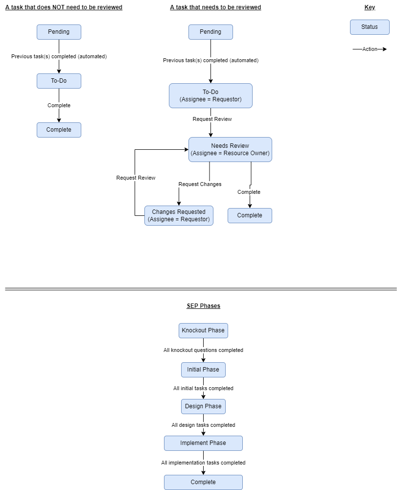

# SEP User Flow

`SEP` is a web application used to help Constellation expedite the Solution Enablement Process (SEP, formerly `AEF`). The SEP process is used to get company approval for use of software on various projects. Requestors create SEPs, which will have various dependent tasks (like a flowchart), that need to be approved and/or completed alongside Resource Owners.

## Personas
### Requestor
A `Requestor` is any user that needs a piece of software approved for their project via the SEP process. They are the user creating a SEP, answering the knockout questions, and providing various documents fot tasks that need to be approved by `Resource Owners`.

### Resource Owner (aka "Reviewer", "Stakeholder", "Owed-To-Person")
A `Resource Owner` is a user that is part of one of the `Departments` (aka Focus Areas) that needs to oversee and approve various tasks for a SEP. Resource Owners have an Azure AD Application Role that designates them as a Resource Owner for a particular Department (ex: a `Legal` role for the Legal department). Resouce owners have the ability to review tasks that require review from their department and to be assigned tasks from their department.

## Knockout Screens
When a Requestor first clicks "Create SEP", they are prompted with various `Knockout Screens`, which will help determine which tasks will be enabled by default for the SEP. Once the user has finished the knockout screens, the SEP moves from the "knockout" phase to the "initial" phase.

## Initiate, Design, and Implement Phases
All tasks related to an SEP are tagged with a phase which can be "initiate", "design", or "implement". This helps to calculate the progress of an SEP.

## Tasks
`Tasks` are items that needs to be completed in order to complete a SEP. Some tasks require the review and approval of Resource Owners, while others are simply marked as "Complete" when they are done. Tasks can be assigned to either Requestors or Resource Owners, as both types of users will have tasks they need to complete as part of the SEP. Tasks are tagged with an `assignee` and can be reassigned to other users as needed. When tasks change their status or assignee, relevant users are notified via email.

When all tasks tagged with a specific phase ("initial", "design", or "implement") are completed, the tasks in that phase are `locked`, making them read-only. (i.e. Their statuses cannot be updated).

